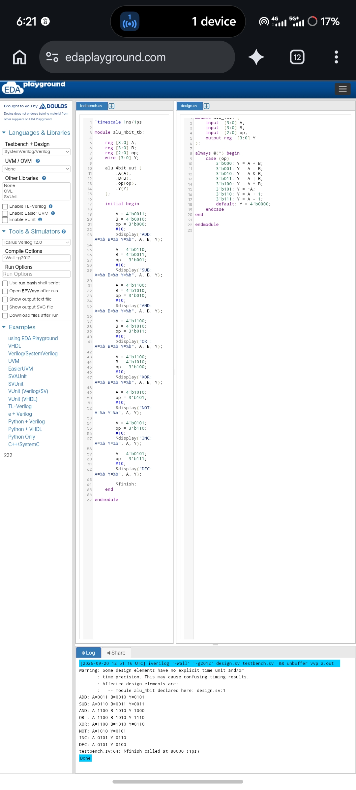

# 4-bit ALU using Verilog HDL

A 4-bit Arithmetic Logic Unit (ALU) designed using Verilog HDL. The design supports arithmetic and logical operations and includes a testbench for functional verification.

## Features

The ALU supports 8 operations:

| OP | Operation |
|---|---|
| 000 | Addition |
| 001 | Subtraction |
| 010 | AND |
| 011 | OR |
| 100 | XOR |
| 101 | NOT A |
| 110 | Increment A |
| 111 | Decrement A |

## Inputs

- `A` – 4-bit input
- `B` – 4-bit input
- `op` – 3-bit operation selector

## Output

- `Y` – 4-bit ALU result

## Files

- `alu_4bit.v` – Main ALU design
- `alu_4bit_tb.v` – Verilog testbench

## Verification

The testbench applies different input combinations and verifies the ALU operations through simulation.

## Tools

- Verilog HDL
- Digital logic
- RTL design concepts
- Verilog simulation

## Author

**Habeeb Shaik**

B.Tech Electronics & Communication Engineering Graduate  
Aspiring VLSI & Embedded Systems Engineer
## Simulation Results

The 4-bit ALU was simulated using Icarus Verilog on EDA Playground.

All 8 implemented operations produced the expected outputs.

### Verification Status

✅ Addition — Passed  
✅ Subtraction — Passed  
✅ AND — Passed  
✅ OR — Passed  
✅ XOR — Passed  
✅ NOT — Passed  
✅ Increment — Passed  
✅ Decrement — Passed

### Simulation Output

